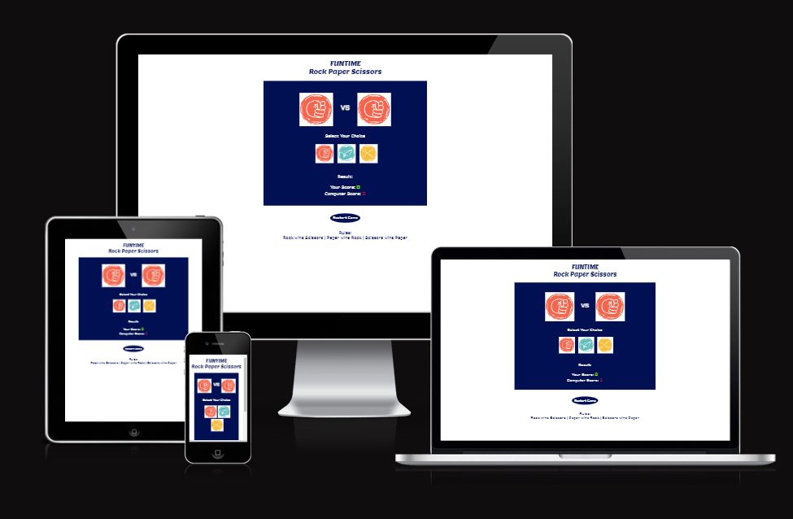
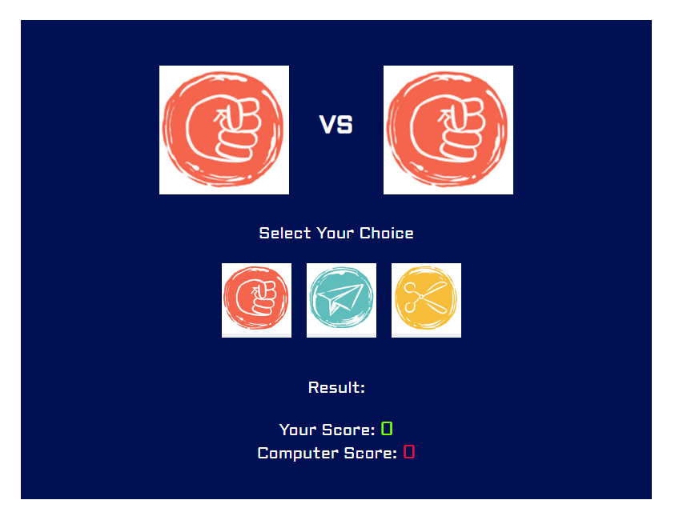
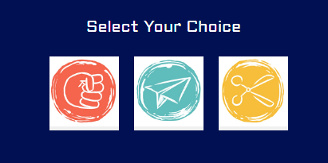
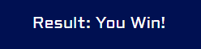
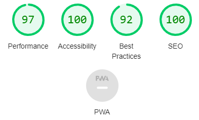

# FUNTIME Rock paper Scissors

FUNTIME Rock Paper Scissor is a single player game which allows user  to compete with the computer.

Users of this game can have fun playing this game and will immediately tell the winner with just a single click on their choice button.

### Features

- The header
  - The header displays the name of the game. it has a font family of Lemon.
  

  
- The Game Area
  - The game area contains four(4) sub-divisions which are important parts of the game.

The four(4) divisions are:
1. The outcome Area
   - This area display to the users their selection and also the randomly generated selection of the computer player.

2. The Selection Area
   - This area gives the user the opportunity to select from three(3) options which will be compared with the computer random choice. 
   - The choice selection will be displayed in the outcome area and a winner will be decided in the result area based on the game rules.

3. The Result Area
   - This is the area where the result of each game outcome is displayed.
   - The result is based on comparison of seletion in the outcome area.
   - It displays "You Win!", "You Lose!" or "Draw!" depending on the outcome.

4. The Score Area
   - The score area is where the score counts after each round of game.
   - It increases the user score if they win and increases the computer score if they lose.
   - The score board remains the same if it is a draw.

- Restart Game
  - This button resets the game.
  - It resets the score board and allow the the user and opportunity to start the game afresh.
  - This button can be used instead of the refresh key.

- The footer
  - The footer contains the rules of the game.

### Testing

---

- I tested the page works on different browsers: Google chrome, Mozilla Firefox and Microsoft edge.

- I tested the pages are responsive and works well on different screen sizes: Desktop, Laptop, Tablet and Mobile phone.

- I tested all buttons worked properly when clicked

### Validator Testing

---

- HTML
  - No error was found when validated with the official W3C HTML validator.
- CSS
  - No error was found when validated with the official jigsaw CSS validator.
- JAVASCRIPT
  - No error was found when validated with JSHint JavaScript validator.

- Accessibility

  - I confirmed that the colors and fonts have the right contrast and are therefore easy to read and access by running it through the lighthouse in devtools.

### Bugs

- No bugs

### Deployment

---

- The site was deployed in GitHub pages and the steps of deployment are as follows:

  - In the GitHub repository, click on the desired repository
  - Navigate to the settings tab
  - Navigate to pages
  - From the source dropdown, select deploy from branch
  - And select main from the branch dropdown and save

  The live link can be found here - [FUNTIME Rock Paper Scissors](https://oladipin.github.io/FUNTIME-RockPaperScissors)

### Credits

---

**Contents**

- Rules of the games was taken from [World Rock Paper Scissors Association](https://wrpsa.com/the-official-rules-of-rock-paper-scissors/)

### Media

---

- The image in this project was taken from [Rock paper Scissors 30a](https://www.rockpaperscissors30a.com/)
